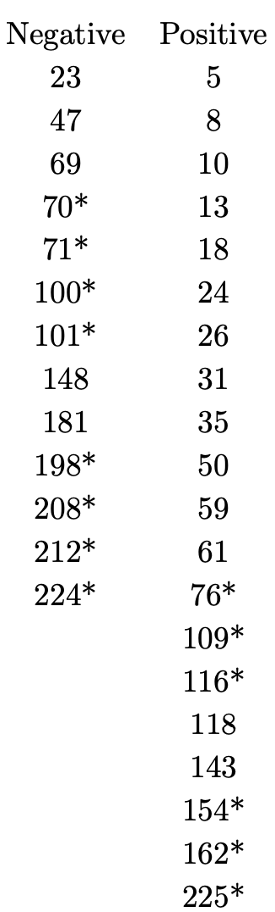

```{r setup, include=FALSE}
knitr::opts_chunk$set(echo = TRUE)
library(dplyr)
library(ggplot2)
library(utile.visuals)
```
In this exercise we consider results from an old investigation to evaluate a histochemical marker that discriminates between primary breast cancer that has metastasized and that which has not. The marker under study is denoted HPA. Each tumor was treated with this marker and hence classified as either positively or negatively stained. The data which will be used is given below. The survival times of each woman is given in months and classified according to whether their tumor was negatively or positively stained. Censored survival times are labeled with an asterisk (*).

```{r, out.height="40%", fig.align='center', echo=FALSE}

```
In the following we denote patients with negatively stained tumors as group 1 and patients with positively stained tumors as group 2.

# Problem 1
## a)
First, a data frame containing the data presented above is constructed.
```{r}
# T.tilde corresponds to the right censored lifetimes,
# while D indicates if the lifetime is right-censored.
# This notation is introduced in problem 2.

df <- data.frame(
  T.tilde = c(23,47,69,70,71,100,101,148,181,198,208,212,224,
             5,8,10,13,18,24,26,31,35,50,59,61,76,109,116,118,143,154,162,225),
  stained =  c(0,0,0,0,0,0,0,0,0,0,0,0,0,1,1,1,1,1,1,1,1,1,1,1,1,1,1,1,1,1,1,1,1),
  D = c(0,0,0,1,1,1,1,0,0,1,1,1,1,0,0,0,0,0,0,0,0,0,0,0,0,1,1,1,0,0,1,1,1))

```

Next, the risk set for each of the two groups, $Y_1(t)$ and $Y_2(t)$ respectively, are plotted as functions of the study time, $t$. The result is given in figure 1.
```{r, fig.cap= "The risk set of group 1 and 2."}
group1 <- filter(df, stained == 0)
group2 <- filter(df, stained == 1)
n <- 250 # Points on the time-axis
t <- 1:n
y1 <- rep(0,n)
y2 <- rep(0,n)
for(i in 1:length(t)){
  y1[i] <- sum(group1$T.tilde > t[i])
  y2[i] <- sum(group2$T.tilde > t[i])
}
ggplot(data.frame(t = t, y1 = y1, y2 = y2)) + geom_step(aes(t, y1, color = "1")) + geom_step(aes(t, y2, color = "2")) +
  ylab("Number of Individuals") + xlab("t (study time)") +
  scale_color_manual(name = "Group", values = c("1" = "#e0474c", "2" = "#7ab8d6"))
```

From figure 1, we observe that group 2 has a much steeper trend than group 1.

## b)
we want to compute the Nelson-Aalen estimator of the integrated hazard rate, $A(t)$, over the grid $t$ and a corresponding confidence interval with significance level $\alpha$ is given. The Nelson-Aalen estimator is defined as
$$
\hat{A}(t) = \sum_{T_j \le t}\frac{1}{Y(T_j)},
$$
where $Y(t)$ is the number of individuals at risk just before time $t$, and $T_j$ are the so-called jump times. To find confidence intervals, we use the following estimate of the variance:
$$
\hat{\sigma}^2(t)  = \sum_{T_j \le t}\frac{1}{Y(T_j)^2}.
$$
We implement two types of confidence intervals; a 'regular' one given by
$$
\hat{A}(t) \pm z_{1-\alpha/2}\cdot \hat{\sigma}(t),
$$
which we reference to as a type 1 confidence interval. Additionally, we implement a confidence interval based on the log-transformation, which is given as
$$
\hat{A}(t)\exp\left(\pm z_{1-\alpha/2}\cdot \hat{\sigma}(t)/\hat{A(t)}\right),
$$
and which we refer to as a type 2 confidence interval. The code which implements this is given below.
```{r}

compute.A.hat <- function(y, t){
  idx <- c(0,(diff(y, lag = 1) < 0)) > 0
  jumps <- rep(Inf, length(y))
  jumps[idx] <- y[idx] + 1
  result <- cumsum(1/jumps)
  return(result)
}

compute.sigma.hat <- function(y,t){
  idx <- c(0,(diff(y, lag = 1) < 0)) > 0
  jumps <- rep(Inf, length(y))
  jumps[idx] <- y[idx] + 1
  result <- sqrt(cumsum(1/jumps^2))
  return(result)
}

N.A.est <- function(df, alpha, conf.int.type, t){
  
    # df: data frame with survival times
    # alpha: significance level of conf.int
    # conf.int.type: type of confidence interval, (1) regular or (2) log-type.
    # t: time grid
  
  y <- rep(0, length(t))
  for(i in 1:length(t)){
    y[i] <- sum(df$T.tilde > t[i])
  }
  A.hat <- compute.A.hat(y,t)
  sigma.hat <- compute.sigma.hat(y, t)
  z = qnorm(1 - alpha/2)
  upper <- lower <- NA
  if(conf.int.type == 1){
    upper <-  A.hat + z*sigma.hat
    lower <- A.hat - z*sigma.hat
  }
  else if(conf.int.type == 2){
    upper <- A.hat * exp(z*sigma.hat/A.hat)
    lower <- A.hat * exp(-z*sigma.hat/A.hat)
  }
  else{
    stop("Invalid conf.int.type")
  }
  return(data.frame(A.hat = A.hat, upper = upper, lower = lower, t = t))
}
```

In the following, the Nelson-Aalen estimator is computed and plotted for the two groups. Figure 2 uses regular confidence intervals, while in figure 3, the confidence interval based on the log-transform is used.

```{r, fig.cap="The Nelson-Aalen estimator of the integrated hazard rate with regular confidence intervals."}
df1 <- N.A.est(group1, 0.05, 1, t)
df2 <- N.A.est(group2, 0.05, 1, t)
ggplot(df1) + geom_step(aes(x = t, y = A.hat, color = "1")) + 
  geom_stepconfint(aes(x = t, ymin=lower, ymax=upper),fill = "#e0474c", alpha = 0.2) +
  geom_step(data = df2, aes(x = t, y = A.hat, color = "2")) +
  geom_stepconfint(data = df2, aes(x = t, ymin=lower, ymax=upper), fill = "#7ab8d6", alpha = 0.2) +
  scale_color_manual(name = "Group", values = c("1" = "#e0474c", "2" = "#7ab8d6"))
```


```{r, fig.cap="The Nelson-Aalen estimator of the integrated hazard rate with confidence intervals based on the log-transform."}
df1 <- N.A.est(group1, 0.05, 2, t)
df2 <- N.A.est(group2, 0.05, 2, t)
ggplot(df1) + geom_step(aes(x = t, y = A.hat, color = "1")) + 
  geom_stepconfint(aes(x = t, ymin=lower, ymax=upper),fill = "#e0474c", alpha = 0.2) +
  geom_step(data = df2, aes(x = t, y = A.hat, color = "2")) +
  geom_stepconfint(data = df2, aes(x = t, ymin=lower, ymax=upper), fill = "#7ab8d6", alpha = 0.2) +
  scale_color_manual(name = "Group", values = c("1" = "#e0474c", "2" = "#7ab8d6"))
  
```

From figure 2 and 3, we observe that $\hat{A}(t)$ grows much faster for group 2 than for group 1.

# Problem 2
## a)
We now want to evaluate the quality of the confidence intervals found in problem 1. We assume to have a group of $n$ individuals with independent and identically distributed lifetimes. Let the hazard rate of the individuals be given by
$$
\lambda(t) = 0.027 \cdot t^{-0.4}.
$$
To find the CDF and PDF of the lifetime(s), $T$, of the individuals, we utilize that

$$
\begin{split}
P(T > t) &:= S_{T}(t) = \exp\left(-\int_0^t\lambda(s)ds\right) \\
&= \exp\left(-\frac{0.027}{0.6}s^{0.6} \Big|_0^t \right) = \exp\left(-\frac{9}{200}t^{0.6}\right).
\end{split}
$$
Then the CDF is given as,

$$
F_{T}(t) = 1- S_T(t) = 1 - \exp\left(-\frac{9}{200}t^{0.6}\right),
$$
and the PDF is given as
$$
f_{T}(t) = \frac{d}{dt}F_{T}(t) = 0.027t^{-0.4}\exp\left(-\frac{9}{200}t^{0.6}\right) = \lambda(t)\exp\left(-\frac{9}{200}t^{0.6}\right).
$$
The censoring times, $C$, are exponentially distributed with PDF
$$
f_C(c;\lambda) = \lambda e^{-\lambda c}.
$$
Consequently, their CDF is given as
$$
F_C(c; \lambda) = \int_0^c\lambda e^{-\lambda x}dx = 1-e^{-\lambda c},
$$
and 
$$
S_{C}(c;\lambda) = 1- F_C(c; \lambda) = e^{-\lambda c}.
$$
We denote the hazard rate of the censoring times by $\alpha(c)$ and find it through the following relation.

$$
\alpha(c) = -\frac{S'_C(c)}{S_C(c)} = \frac{-\lambda e^{-\lambda c}}{e^{-\lambda c}} = \lambda.
$$
A plot of $\lambda(t)$ and $\alpha(c)$ is given in figure 4.

```{r, fig.cap="The hazard rates of the lifetimes and censoring times."}
T.hazard <- function(t){
  return(0.027*t^(-0.4))
}

lambda <- 0.02
C.hazard <- function(c){ 
  return(lambda)
}

ggplot(data.frame(t = seq(0, 10, by = 0.01)), aes(t)) +
  geom_function(fun = T.hazard, aes(color = "T")) +
  geom_function(fun = C.hazard, aes(color = "C")) + 
  scale_color_manual(name = "", values = c("T" = "#e0474c", "C" = "#7ab8d6")) + ylab("Hazard rate")
```


The densities, $f_C(c)$ and $f_T(t)$ are plotted in figure 5.

```{r, fig.cap="The PDFs of the lifetimes and censoring times."}
f.T <- function(t){
  return(T.hazard(t)*exp(-9/200 * t^(0.6)))
}

f.C <- function(c){ 
  return(lambda*exp(-lambda*c))
}

ggplot(data.frame(t = seq(0, 500, by = 0.01)), aes(t)) +
  geom_function(fun = f.T, aes(color = "T")) +
  geom_function(fun = f.C, aes(color = "C")) + 
  scale_color_manual(name = "", values = c("T" = "#e0474c", "C" = "#7ab8d6")) + ylab("Density")

```


## b)

For individual number $i$, we define the right censored survival time

$$
\widetilde{T}_i = \min\{T_i, C_i\},
$$
which is what we observe. We also define the censoring indicator

$$
D_i = \begin{cases} 1,\quad \text{if }T \le C_i \\
0, \quad \text{otherwise}.
\end{cases}
$$

An R-function which simulates $\widetilde{T}$ and $D_i$ for $n$ individuals is given below. To simulate from $f_T$ and $f_C$, we use the probability integral transform method. 
```{r}
sim.C <- function(n, lambda){
  u <- runif(n)
  c <- -log(1-u)/lambda
  return(c)
}

sim.T <- function(n){
  u <- runif(n)
  t <- (-200/9 * log(1 - u))^(5/3)
  return(t)
}

sim.TD <- function(n, lambda, floor = TRUE){
  t <- sim.T(n)
  c <- sim.C(n, lambda)
  t.tilde = pmin(t,c)
  if(floor){
    t.tilde = floor((t.tilde))
  }
  d <- (c < t)
  
  df <- data.frame(T.tilde = t.tilde, D = d)
  if(max(t.tilde) < 150){
    sim.TD(n, lambda)
  } else{
    return(df)
  }
}
```

## c)

```{r}
n1 <- 13
n2 <- 20

sim1 <- sim.TD(n1, lambda)
sim2 <- sim.TD(n2, lambda)

tmax <- max(sim1,sim2)
tmax
max(sim2$T.tilde)

df1 <- N.A.est(sim1, 0.05, 2, 0:tmax)
df2 <- N.A.est(sim2, 0.05, 2, 0:tmax)
ggplot(df1) + geom_step(aes(x = t, y = A.hat, color = "1")) + 
  geom_stepconfint(aes(x = t, ymin=lower, ymax=upper),fill = "#e0474c", alpha = 0.2) +
  geom_step(data = df2, aes(x = t, y = A.hat, color = "2")) +
  geom_stepconfint(data = df2, aes(x = t, ymin=lower, ymax=upper), fill = "#7ab8d6", alpha = 0.2) +
  scale_color_manual(name = "Group", values = c("1" = "#e0474c", "2" = "#7ab8d6"))
```
After running the above code a dozen times, it is seems that the confidence intervals will almost always overlap for the two groups, at lead for $t >50$. Since the confidence intervals of the 'real' groups nearly only overlap for $t > 200$, this suggests that the hazard rates do in fact differ.


## d)
```{r}
point.conf.int <- function(sim.df, t.point, alpha, conf.int.type){
  df.A.hat <- N.A.est(sim.df, alpha, conf.int.type, 0:max(sim.df$T.tilde))
  A.hat <- filter(df.A.hat, t == t.point)
  return(c(A.hat$lower, A.hat$upper))
}
```

## e)
Now we want to assess the coverage probability of the different types of confidence intervals we have considered. Firstly, we note that the analytic expression for the integrated hazard rate is


$$
A(t) = \int_0^t \lambda(s)ds = \frac{9}{200}t^{0.6}.
$$
For all combinations $n \in \{13, 20\}$, $t \in \{50, 100, 150\}$ and $\alpha \in \{0.01, 0.05, 0.10\}$ we want to estimate the coverage probability of the approximate confidence intervals. An R-function whhich does this for one such combination is given below.

```{r}
n <- 13
t.point <- 50
alpha <- 0.01

A.exact <- function(t){return(9/200 * t^0.6)}

est.coverage <- function(n, t.point, alpha, iter, conf.int.type){
  result.vec = rep(NA, iter)
  A <- A.exact(t.point)
  print(A)
  for(i in 1:iter){
    sim.df <- sim.TD(n, lambda)
    conf.int <- point.conf.int(sim.df, t.point, alpha, conf.int.type)
    print(conf.int)
    result.vec[i] = (A > conf.int[1] & A < conf.int[2])
  }
  return(sum(result.vec)/length(result.vec))
}
```

```{r}
n <- 13
t.point <- 50
alpha <- 0.01
iter <- 10
conf.int.type <- 1
est.coverage(n, t.point, alpha, iter, conf.int.type)
```

